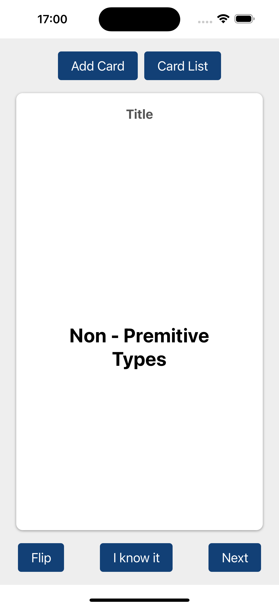
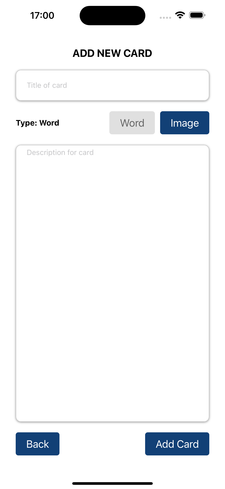
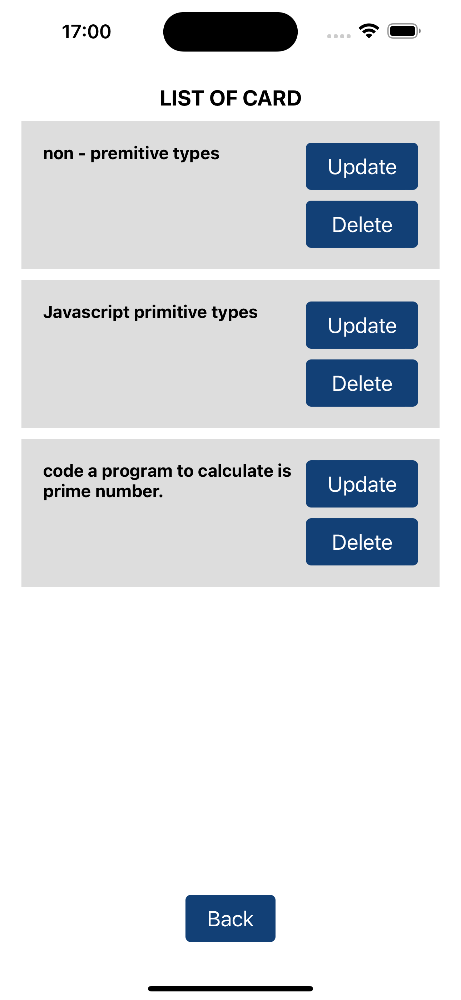

# Simple flash card app with firebase

This is a React Flash Card, help user to learn fast, simple and mobility with firebase and mmkv storage.

Additional features:

- [Firebse](https://firebase.google.com/) for authentication, database.
- [Zuntand](https://redux.js.org/introduction/getting-started) and [MMKV](https://github.com/mrousavy/react-native-mmkv) for state management
- [Expo Router](https://docs.expo.dev/router/introduction/) for router.

## Screenshotss

## Demo

